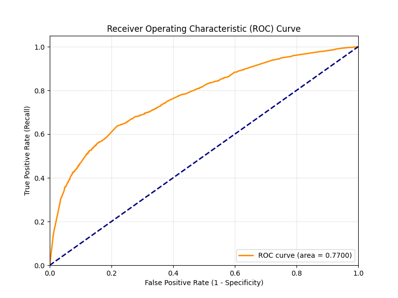
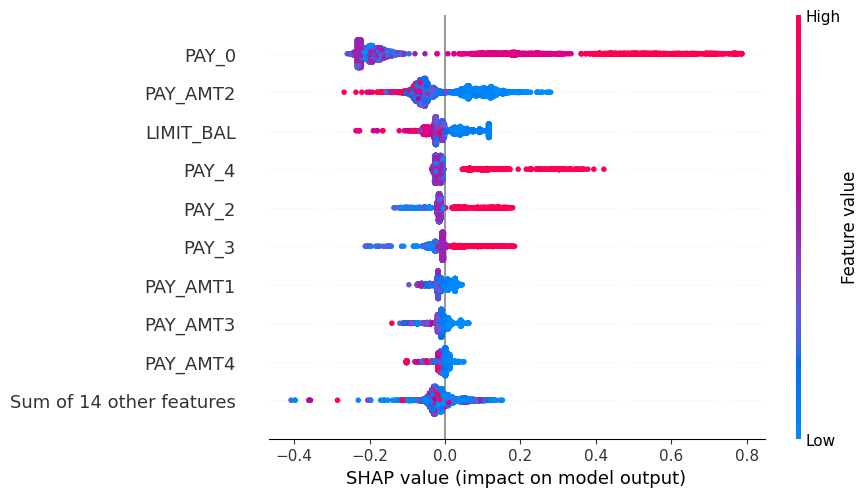

#  金融風控預警系統：基於 XGBoost 與 SHAP 的可解釋 AI 模型

這是一個針對信用卡違約風險進行預測的機器學習專案。本專案不僅追求高預測性能，更強調金融實務中的**召回率 (Recall)** 與 **模型可解釋性 (XAI)**。

##  核心亮點 (Project Highlights)
- **硬體加速**：利用 NVIDIA GPU (CUDA) 進行 XGBoost 大數據加速運算。
- **風險導向**：透過權重調整 (Scale_Pos_Weight)，成功將違約捕捉率提升至 **62%**。
- **透明決策**：整合 SHAP 全視覺化套件，打破 AI 黑盒子，量化關鍵決策因子。

##  績效指標 (Model Performance)
| 指標 | 數值 | 意義 |
| :--- | :--- | :--- |
| **Recall (召回率)** | **0.62** | 成功攔截 62% 的潛在違約客戶 |
| **AUC** | **0.7793** | 模型具備優異的風險區分能力 |
| **Accuracy** | **0.76** | 整體判斷穩定度 |

##  SHAP 關鍵特徵分析
根據 SHAP 全局分析，模型決策的前三大核心指標為：
1. **PAY_0 (0.54)**: 最近一期還款行為（最強預警指標）。
2. **LIMIT_BAL (0.21)**: 客戶信用額度（抗風險能力指標）。
3. **BILL_AMT1 (0.13)**: 客戶當前負債壓力。

##  視覺化圖表預覽

##  技術棧 (Tech Stack)
- **Model**: XGBoost (hist + cuda)
- **Explainability**: SHAP (Summary, Waterfall, Dependence plots)
- **Evaluation**: Repeated K-Fold, ROC-AUC, Confusion Matrix
